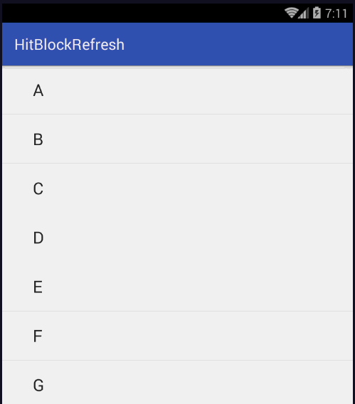
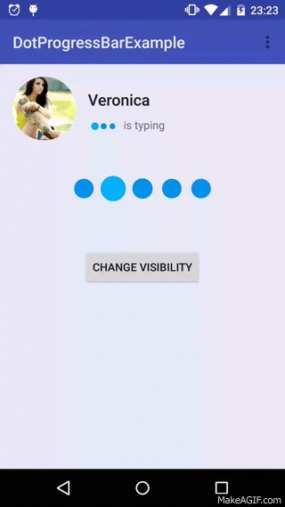
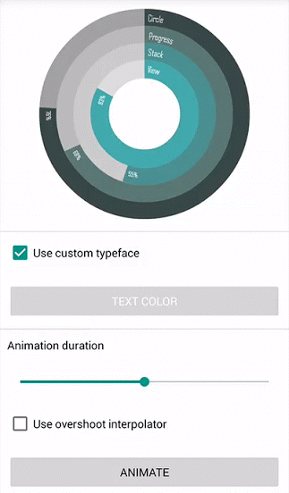
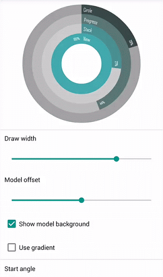
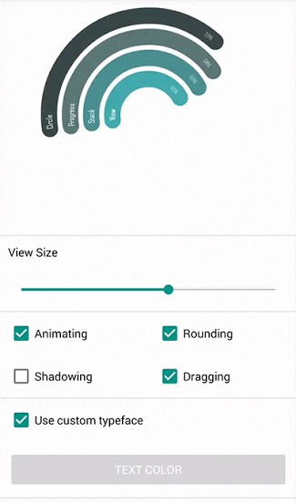
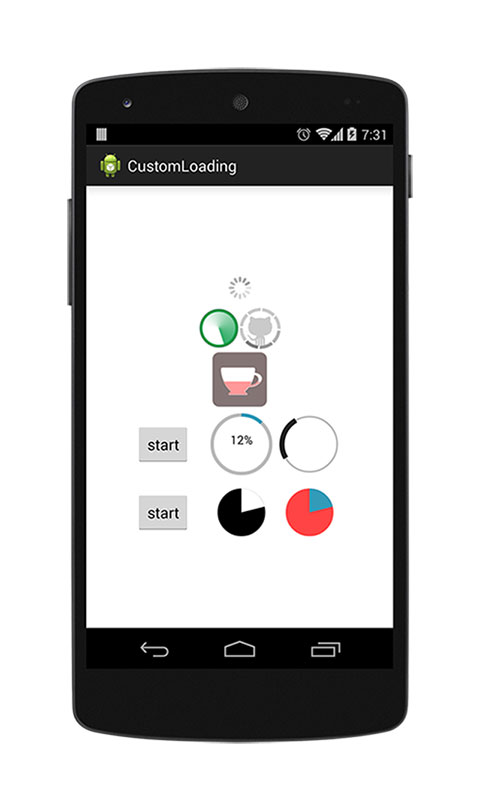

# Android----Loading
史上最全、新鲜、创意、炫酷的Loading都在这儿了

1.渐变的圆形进度条与轻量横向进度条:MagicProgressCircle & MagicProgressBar http://blog.dreamtobe.cn/2015/12/13/magic_progress_widget/         
项目地址:https://github.com/lingochamp/MagicProgressWidget                                  
                              

2.支持百分比的 ProgressBar 。Android custom Circular ProgresBar and Line ProgressBar with progress percentage shown.                   
项目地址:https://github.com/natasam/Android-PercentProgressBar-lib                                 

**3.具有粘性的滑动小球，跌落反弹形成loading的效果**    
项目地址:https://github.com/yxping/AdhesiveLoadingView                 

**4.好玩的下拉刷新控件，一边下拉刷新，一边打砖块**    
项目地址:https://github.com/Hitomis/HitBlockRefresh    

**5.DotProgressBarIt`s a simple progress bar.**       
https://github.com/silvestrpredko/DotProgressBarExample           

**6.ArcProgressStackView：Present your progress bars in arc mode with information and total control.**     
https://github.com/GIGAMOLE/ArcProgressStackView       

**7.CustomLoading For Android;https://github.com/stormzhang/CustomLoading**           
       

**8.**

